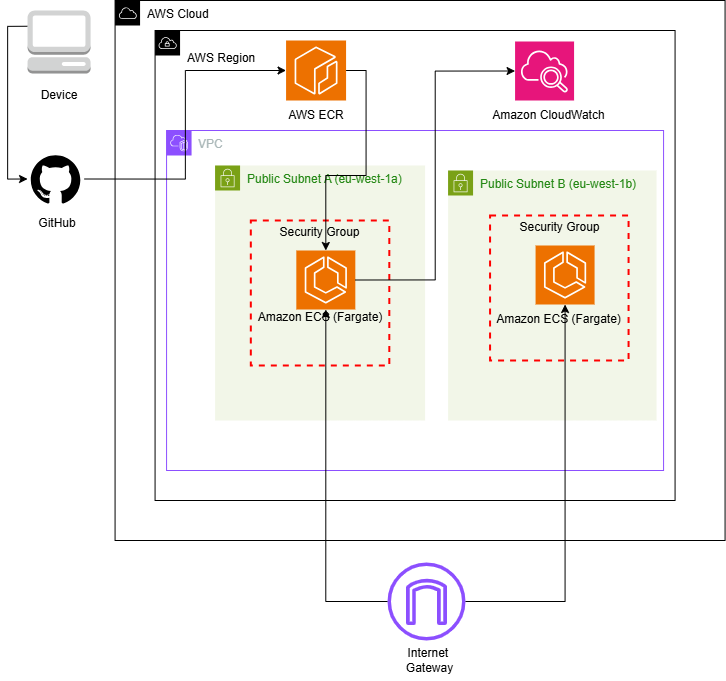

# Containerized Application Deployment on AWS ECS

An automated, secure, and production-ready CI/CD infrastructure project that deploys a containerized Python Flask application to AWS ECS Fargate using Terraform and GitHub Actions.

---

# Project Overview & Goals

The core objective of this project is to implement a modern, serverless container lifecycle that completely avoids the overhead of managing virtual servers or handling risky, static cloud credentials.

## Key Design Goals

### Zero-Server Compute (AWS Fargate)
Runs containers serverlessly across isolated subnets, removing the need to provision, patch, or scale underlying EC2 instances.

### Passwordless CI/CD (OIDC)
Uses an IAM OpenID Connect (OIDC) trust relationship between GitHub Actions and AWS. This eliminates the need for long-lived, static IAM access keys in your repository.

### Optimized Multi-Stage Builds
Minimizes container image sizes by stripping out build-time dependencies, keeping the production runtime slim, fast, and secure.

### Automated Rolling Updates
Runs a two-stage GitHub Actions pipeline (`build-and-push` followed by `deploy-infrastructure`) to trigger zero-downtime rolling updates in ECS on every push to the `main` branch.

---

## System Architecture

Traffic routes from the internet through an Internet Gateway directly to container workloads running inside public subnets across multiple Availability Zones (`eu-west-1a` and `eu-west-1b`). Task-level Security Groups act as a stateful firewall to protect the containers.



### Architectural Workflow Breakdown

The system's architecture is divided into two primary flows: the **CI/CD Deployment Pipeline** (top-down) and the **Client Traffic Flow** (bottom-up).

#### 1. CI/CD & Deployment Pipeline (Developer to ECS)
* **Code Push:** A developer commits and pushes code updates from their **Device** to **GitHub**.
* **Image Registry Delivery:** Triggered by the push, GitHub Actions builds the Docker container image and securely pushes it directly to **Amazon ECR (Elastic Container Registry)** within the target AWS Region.
* **Task Deployment:** Once the new image is available in ECR, the pipeline signals AWS ECS to update. The **Amazon ECS (Fargate)** task in **Public Subnet A (`eu-west-1a`)** pulls the fresh image layers from ECR to spin up the updated application container.

#### 2. Network Isolation & Compute Layer (Inside the VPC)
* **VPC Boundaries:** All compute resources run inside a secure, custom **Virtual Private Cloud (VPC)** designed for high availability.
* **Multi-AZ Distribution:** The architecture spans two separate Availability Zones (AZs) to ensure resilience:
  * **Public Subnet A (`eu-west-1a`)**
  * **Public Subnet B (`eu-west-1b`)**
* **Serverless Execution:** Containers run as serverless tasks on **Amazon ECS (Fargate)**, meaning there are no EC2 instances to manage or patch.
* **Stateful Firewalls:** Each ECS Fargate task is encapsulated within its own dedicated **Security Group**, limiting open ingress strictly to the required application port while permitting necessary outbound routing.

#### 3. Monitoring & Edge Routing
* **Logging & Observability:** The containerized application sends its execution, diagnostic, and error logs directly to **Amazon CloudWatch** for centralized log retention and monitoring.
* **Internet-Facing Access:** An **Internet Gateway** sits at the edge of the VPC, routing incoming external HTTP requests from clients directly to the running Fargate containers in both public subnets.

---

# AWS Services Used

The infrastructure combines the following AWS resources to form a secure, highly resilient, and isolated compute environment:

- **Amazon VPC**
  - Dedicated network (`10.0.0.0/16`)
  - Public subnets across two Availability Zones (`eu-west-1a` and `eu-west-1b`)
  - High availability architecture

- **IAM OIDC Identity Provider & IAM Roles**
  - Grants short-lived credentials to GitHub Actions
  - Eliminates static IAM access keys

- **Amazon ECR (Elastic Container Registry)**
  - Private Docker image registry
  - Stores versioned container images tagged with Git commit SHAs

- **Amazon ECS (Fargate Launch Type)**
  - Serverless container orchestration
  - Automatically provisions and scales containerized workloads

- **AWS Security Groups**
  - Allows inbound traffic only on port **80**
  - Allows unrestricted outbound traffic

- **Amazon CloudWatch Logs**
  - Collects application logs (`stdout` and `stderr`)
  - Enables centralized monitoring and troubleshooting

---

# Step-by-Step Deployment Guide

## Prerequisites

Before deploying, ensure you have:

- AWS CLI installed and configured
- Terraform installed
- Docker installed
- A GitHub repository containing the application source code

---

## Step 1: Initialize and Provision Infrastructure

Navigate to the Terraform directory and execute:

```bash
# Initialize Terraform
terraform init

# Validate the configuration
terraform validate

# Preview infrastructure changes
terraform plan

# Provision AWS infrastructure
terraform apply -auto-approve
```

---

## Step 2: Configure GitHub Actions Authentication (OIDC)

Instead of storing AWS credentials in GitHub Secrets, configure GitHub Actions to assume the IAM role created by Terraform.

1. Copy the GitHub Actions IAM Role ARN from the Terraform outputs.
2. Navigate to:

```
GitHub Repository
→ Settings
→ Secrets and variables
→ Actions
→ Variables
```

3. Add the following repository variables:

| Variable | Value |
|----------|-------|
| `AWS_ROLE_TO_ASSUME` | `arn:aws:iam::146445314795:role/flask-app-github-actions-role-dev` |
| `AWS_REGION` | `eu-west-1` |

---

## Step 3: Trigger the CI/CD Pipeline

Commit and push the application, Dockerfile, Terraform configuration, and GitHub Actions workflow.

```bash
git add .
git commit -m "feat: setup automated infrastructure and container scaling"
git push origin main
```

Pushing to the `main` branch automatically starts the deployment pipeline.

### Stage 1 – Build and Push

- Authenticates to AWS using OIDC
- Builds the optimized multi-stage Docker image
- Pushes the image to Amazon ECR

### Stage 2 – Deploy Infrastructure

- Updates the ECS service
- Forces a new deployment
- Performs a rolling update with zero downtime

---

## Step 4: Verify the Deployment

Retrieve the public IP address of the running ECS task:

```bash
aws ecs list-tasks \
  --cluster flask-app-cluster-dev \
  --query "taskArns[]" \
  --output text | \
xargs -I {} aws ecs describe-tasks \
  --cluster flask-app-cluster-dev \
  --tasks {} \
  --query "tasks[*].attachments[*].details[?name=='networkInterfaceId'].value" \
  --output text | \
xargs -I {} aws ec2 describe-network-interfaces \
  --network-interface-ids {} \
  --query "NetworkInterfaces[*].Association.PublicIp" \
  --output text
```

Open the returned public IP address in your browser:

```text
http://<EXTRACTED_PUBLIC_IP>
```

If the deployment is successful, the Flask application will respond with its expected output.

---

# Deployment Workflow Summary

```text
Developer Push
       │
       ▼
GitHub Actions
       │
       ├──────────────► Authenticate with AWS (OIDC)
       │
       ▼
Build Docker Image
       │
       ▼
Push Image to Amazon ECR
       │
       ▼
Terraform Infrastructure
       │
       ▼
Amazon ECS (Fargate)
       │
       ▼
Rolling Deployment
       │
       ▼
Running Flask Application
```
